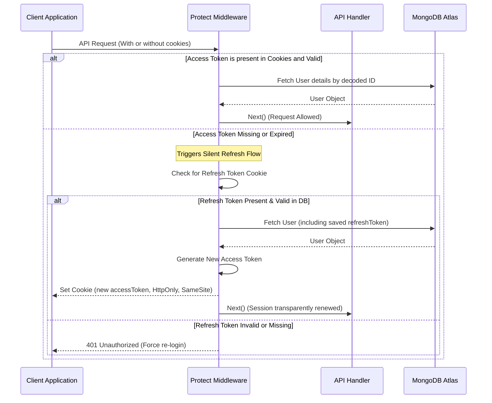

# ChilleBazzar E-Commerce Backend Architecture

Welcome to the architectural walkthrough of the **ChilleBazzar API** backend. This system is a production-grade, highly structured, secure, and performant REST API built with **Express** and **TypeScript**. It powers a multi-vendor agricultural marketplace connecting farmers directly with buyers.

---

## 🚀 Technical Stack & Tools

*   **Runtime & Language:** Node.js, TypeScript (`tsconfig.json` strict type resolution).
*   **Web Framework:** Express (v5.2.1) with robust asynchronous error handling via a customized `catchAsync` wrapper and global centralized error handling middleware.
*   **Database:** MongoDB Atlas, orchestrated using Mongoose Object-Data Mapping (ODM) with strict schema validation and reference-based population.
*   **Authentication & Security:** 
    *   JSON Web Tokens (JWT) using a secure **double-token cookie approach** (Access Token + Refresh Token).
    *   Password encryption using `bcryptjs`.
    *   Security headers using `helmet`.
    *   API Rate limiting via `express-rate-limit`.
    *   Configurable Cross-Origin Resource Sharing (CORS) with support for credentials.
*   **File Uploads:** Integrated Cloudinary storage using `multer` and `multer-storage-cloudinary` for uploading product images and farmer certification documents.
*   **Payments:** Stripe payment gateway integration with full webhook support.
*   **Emails:** Automatic notifications (OTP, password resets) powered by `nodemailer`.

---

## 📁 System Directory Structure

The codebase is organized cleanly to enforce **Separation of Concerns (SoC)** and follows standard MVC routing patterns:

```
apps/api/
├── src/
│   ├── config/             # Database connection, Cloudinary upload & service configurations
│   ├── controllers/        # Business logic handlers for all API resources
│   ├── middleware/         # Auth verification, role checks, rate limiters, global error handler
│   ├── models/             # Mongoose/MongoDB schemas & TS Interfaces
│   ├── routes/             # Express route mappings/endpoints split by domains
│   ├── utils/              # Utility helpers, standard AppError class, Cloudinary functions
│   └── index.ts            # Entry point. Configures & bootstraps the Express server
├── .env                    # System environment secrets
├── package.json            # Node dependencies and build scripts
└── tsconfig.json           # TypeScript compiler instructions
```

---

## 🔐 Authentication & Security Workflow

The system uses a highly secure, frictionless **Double Token + Silent Refresh Cookie system**:



### Key Security Features Implemented:
1. **HttpOnly & SameSite Cookies:** Both the `accessToken` (expiring in 1 hour) and `refreshToken` are set in secure, HTTP-only, strict SameSite cookies to protect against XSS and CSRF attacks.
2. **Role-Based Access Control (RBAC):** Using the customizable `restrictTo(...roles)` middleware, routes are guarded based on enum roles:
    *   `admin`: Full platform control, farmer verification, toggle product state.
    *   `farmer`: Product creation, updating own products, managing farmer profiles.
    *   `user`: Consumer actions (browsing products, cart management, ordering, review publishing).
    *   `dilivery`: Delivery management.
3. **Stripe Webhook Body Handling:** In [index.ts](file:///d:/Software%20Eng%20%2803-2026%29/E-commers/Cb%20Test/ChilleBazzare/chilleBazzar-eCom/apps/api/src/index.ts), the payments route is mounted **before** `express.json()` and `express.urlencoded()` to ensure the Stripe SDK gets the pristine raw request body needed to verify signatures.

---

## 🗄️ Database Schema & Data Models

### 1. User Model (`User.ts`)
*   Contains core credentials: `name`, `email` (unique, lowercase), `password` (hashed with `bcryptjs` and marked as `select: false`), and `phone`.
*   Supports user account statuses (`isActive`, `isVerified`) and handles brute-force defense mechanism variables (`loginAttempts`, `lockUntil`).
*   Provides automated pre-save hooks to hash password updates dynamically.

### 2. Product Model (`Product.ts`)
*   Key fields: `productName`, `productDescription`, `price`, `quantity`, and `productType` (enum: `produce`, `seeds`, `fertilizers`, `equipment`, `other`).
*   Strict validation constraints limit product images and certificate uploads to **maximum 2 files each**.
*   Linked to a specific `farmerId` (ref `User`) and `categoryId` (ref `Category`).
*   Includes `isActive` flag which controls public availability (Admin must approve, or farmer toggles to activate/deactivate).

### 3. Farmer Profile Model (`FarmerProfile.ts`)
*   Extends a User with specific farming credentials: `farmName`, `description`, `address`, and `rating`.
*   Maintains a strict 1-to-1 relationship with the parent User model via the `userId` field (marked as `unique: true`).

### Other Modules:
*   `Order.ts`: Manages stripe session records, pricing structures, shipping addresses, order status updates, and tracking coordinates.
*   `Cart.ts`: Holds customer cart lists containing items, quantities, and totals.
*   `Review.ts`: Handles customer reviews with a rating from 1 to 5, connected directly to a specific product.
*   `AuditLog.ts`: Logs administrative and security events for compliance and analytics.

---

## 💡 Key Design Patterns Observed

*   **Global Error Handling Pattern:** Every endpoint is wrapped inside a `catchAsync` wrapper which captures internal rejects/throws and forwards them to a centralized Express error handler via `next(new AppError(...))`. This prevents the application from crashing and guarantees standardized, consistent JSON error responses across all microservices.
*   **Schema-Level Methods:** The database contains schema-level encapsulation (e.g., `UserSchema.methods.comparePassword`) to keep domain operations cleanly tied to database objects.
*   **Media Management Middleware:** Multer middleware integrates directly with Cloudinary, automatically uploading files to a specified bucket directory (`chillebazzar_products`) and injecting the resulting Cloudinary URLs directly into `req.files` for schema persistence.
