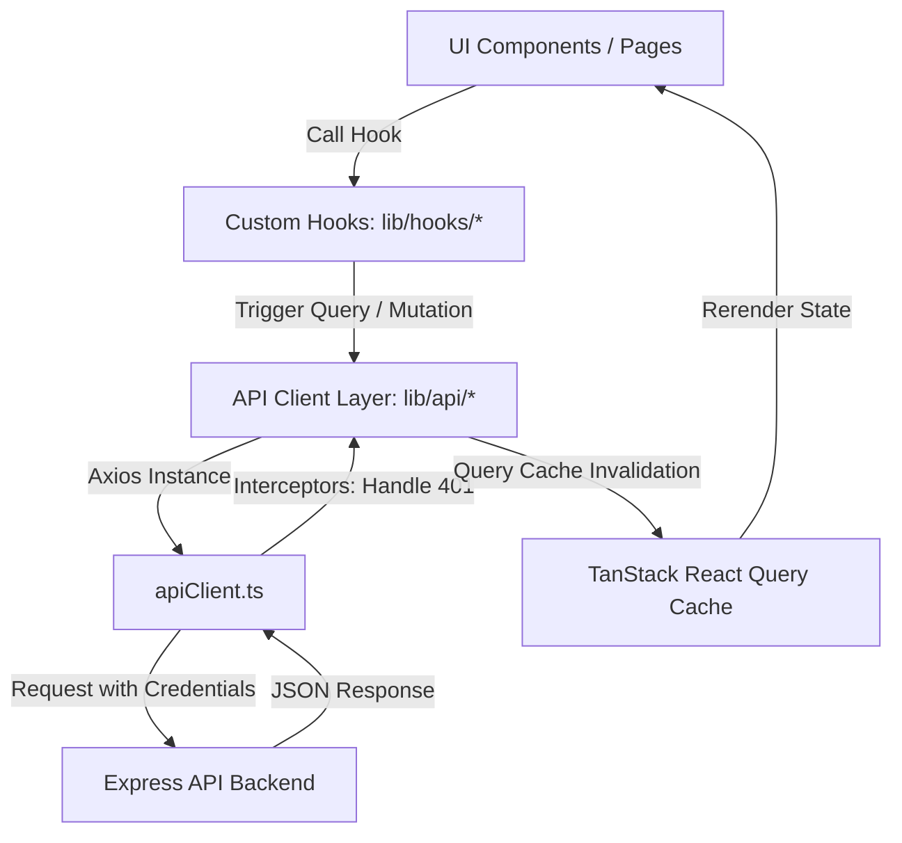

# ChilleBazzar User Frontend Architecture

Welcome to the architectural walkthrough of the **ChilleBazzar User Frontend**. This is a state-of-the-art web application engineered with **Next.js 16 (App Router)** and **React 19**. It is styled using the cutting-edge **Tailwind CSS v4** engine and optimized for luxury, responsiveness, and premium design standards.

---

## 🎨 Premium Organic Design System

The application strictly implements the design tokens from [ui-context.md](file:///d:/Software%20Eng%20%2803-2026%29/E-commers/Cb%20Test/ChilleBazzare/chilleBazzar-eCom/apps/user-front/ui-context.md) to create an organic, premium sensory atmosphere aligned with high-end artisanal produce.

### 1. OKLCH Color Engine (`globals.css`)
Unlike traditional RGB/HEX styling, the color system is built entirely on the perceptually uniform **OKLCH space** in [globals.css](file:///d:/Software%20Eng%20%2803-2026%29/E-commers/Cb%20Test/ChilleBazzare/chilleBazzar-eCom/apps/user-front/app/globals.css) to support rich contrast and uniform dark-mode toggling:
*   `--primary`: `oklch(0.527 0.154 25.069)` — A vibrant, rich **Chilli Red**.
*   `--background`: `oklch(1 0 0)` — Crisp, high-end organic **Pure White**.
*   `--foreground`: `oklch(0.145 0 0)` — Deep charcoal luxury text.
*   `--heading`: `#240000` (Light) / `#ff7b7b` (Dark) — Intense, tracking-tight **Maroon**.

### 2. Premium Typography
*   **Primary & Display Font:** `Geist` Sans-serif loaded with next-generation optimization in [layout.tsx](file:///d:/Software%20Eng%20%2803-2026%29/E-commers/Cb%20Test/ChilleBazzare/chilleBazzar-eCom/apps/user-front/app/layout.tsx). Massive heavy headings are uppercase and tracking-tight to invoke an artisanal, high-end catalog feel.

### 3. Glassmorphism & Micro-animations
*   Borders use subtle organic colors (`border-primary/10` or `border-border`).
*   Transitions leverage `framer-motion` for fluid entrances, scale changes, and continuous floating badges, alongside Lucide icon interactions.

---

## 📂 Project Directory Structure

```
apps/user-front/
├── app/                    # Next.js App Router (Pages, layouts, styles)
│   ├── shop/               # Shop search grid, categories sidebar & product page ([id])
│   ├── cart/               # Cart list & Stripe payment initiation
│   ├── farmer-dashboard/   # Specialized panel for agricultural sellers
│   ├── login/ / register/  # Authentication forms
│   ├── globals.css         # OKLCH tokens, Tailwind directives, baseline layers
│   └── layout.tsx          # Root Shell (Geist fonts, Theme, Query & Toast providers)
├── components/             # Reusable global layout elements & Shadcn primitives
│   ├── ui/                 # Accessible primitives (Radix Dialogs, Selects, Sheets, Drawer)
│   ├── Hero.tsx            # Animated high-end branding landing hero
│   └── Navbar.tsx          # Dynamic navigation with auth-state integration
├── lib/                    # Core library modules
│   ├── api/                # Dedicated endpoint clients (auth, product, order, review, etc.)
│   ├── hooks/              # Custom React Query custom hooks
│   └── utils.ts            # Class merges (clsx + tailwind-merge)
├── components.json         # Shadcn compilation config
└── package.json            # Client packages and runtime definitions
```

---

## ⚡ API client & State Management Flow

The application integrates with the backend database via a structured **two-layer state system**:



### 1. Global Interceptor Engine (`apiClient.ts`)
*   Located in [apiClient.ts](file:///d:/Software%20Eng%20%2803-2026%29/E-commers/Cb%20Test/ChilleBazzare/chilleBazzar-eCom/apps/user-front/lib/api/apiClient.ts).
*   Enables `withCredentials: true` globally so the browser automatically handles the **HttpOnly Access & Refresh Token cookies** for all API actions.
*   Includes a response interceptor that catches `401 Unauthorized` errors and automatically redirects invalid sessions back to `/login` to avoid security loops.

### 2. Custom Hooks Layer (`lib/hooks/*`)
*   Every domain has a dedicated custom query/mutation file (e.g., [useAuth.ts](file:///d:/Software%20Eng%20%2803-2026%29/E-commers/Cb%20Test/ChilleBazzare/chilleBazzar-eCom/apps/user-front/lib/hooks/useAuth.ts), `useProduct.ts`, `useCart.ts`).
*   Mutations cleanly call `queryClient.invalidateQueries` to automatically refresh related UI queries when database entities are altered (e.g., clearing the `"me"` user cache upon logging out).
*   Integrated directly with the `sonner` toaster to flash elegant, colorful success/error alerts.

---

## 💡 Notable UX & Architectural Details

*   **Responsive Sidebar Navigation:** The [Navbar.tsx](file:///d:/Software%20Eng%20%2803-2026%29/E-commers/Cb%20Test/ChilleBazzare/chilleBazzar-eCom/apps/user-front/components/Navbar.tsx) utilizes Radix Sheet components to translate standard desktop menu headers into polished side-drawer overlays on mobile viewpoints.
*   **Modular Page Segments:** Page views are split cleanly. For instance, [page.tsx](file:///d:/Software%20Eng%20%2803-2026%29/E-commers/Cb%20Test/ChilleBazzare/chilleBazzar-eCom/apps/user-front/app/shop/page.tsx) splits the main shop interface into isolated client fragments (`ShopHeader`, `ShopSidebar`, and `ProductGrid`) to prevent excessive renders.
